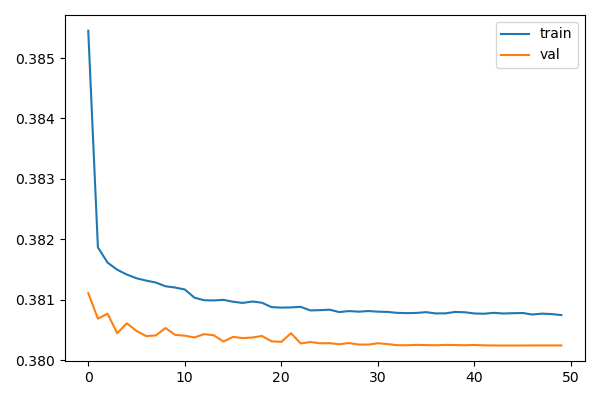
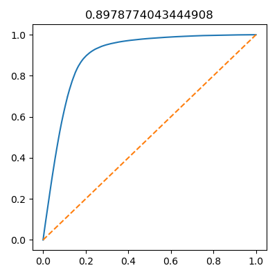
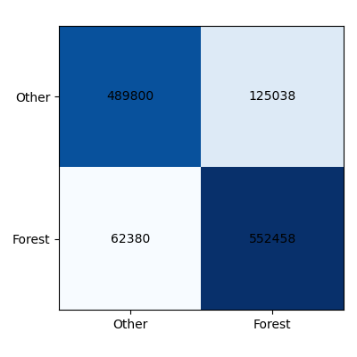
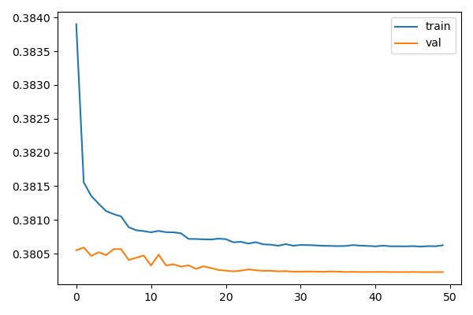
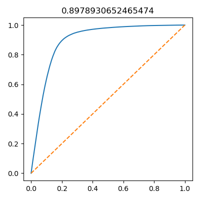
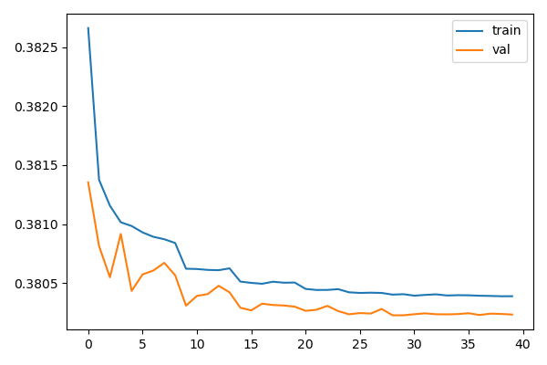
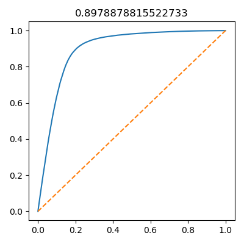

# CPE_KU-204466 Deep Learning Project  
## การจำแนกป่าไม้โดยใช้ข้อมูล Time Series จากดาวเทียม

### รายละเอียดโครงการ
โปรเจกต์นี้เป็นการทดลองจำแนกพื้นที่ป่าไม้ (Forest) ออกจากพื้นที่อื่น (Other) โดยใช้ข้อมูลอนุกรมเวลาจากดัชนีดาวเทียมรายเดือน (SAVI และ MNDWI) เป็นข้อมูลนำเข้าให้กับโมเดล Deep Learning 3 รูปแบบ ได้แก่  
- LSTM (Baseline)  
- Bidirectional LSTM + Attention  
- Transformer Encoder

---

## 1. ปัญหา (Problem)

การจำแนกพื้นที่ป่าไม้จากข้อมูลดาวเทียมแบบอนุกรมเวลาเป็นโจทย์ที่มีความท้าทาย เนื่องจากโมเดลต้องสามารถเรียนรู้ **ลายเซ็นเชิงฤดูกาล (seasonal signatures)** ของพืชพรรณ เช่น ช่วงที่ค่าดัชนี SAVI สูงสุดในฤดูฝน หรือการเปลี่ยนแปลงของค่าดัชนีน้ำในหน้าแล้ง

นอกจากนี้ยังมีปัญหา Data Imbalance — จำนวนพิกเซลที่เป็นป่าไม้มักน้อยกว่าพื้นที่อื่น จึงต้องใช้วิธี Balanced Sampling เพื่อป้องกันโมเดลเอนเอียงไปทางคลาสที่มีจำนวนมากกว่า

---

## 2. วัตถุประสงค์ (Objectives)

1. สร้างโมเดล Deep Learning สำหรับจำแนกพิกเซลเป็น Forest หรือ Other  
2. เปรียบเทียบประสิทธิภาพของสถาปัตยกรรม 3 รูปแบบ  
   - LSTM  
   - BiLSTM + Attention  
   - Transformer Encoder  
3. วิเคราะห์ผลเชิงประสิทธิภาพ (Accuracy, Precision, Recall, F1, AUC) เพื่อหาสถาปัตยกรรมที่เหมาะสมที่สุดทั้งในเชิงเทคนิคและเชิงปฏิบัติ

---

## 3. ข้อมูลและการเตรียมข้อมูล (Data Description)

| รายการ | รายละเอียด |
|:--|:--|
| Label (y) | จากแผนที่ LULC โดยกำหนดว่า LULC > 6000 → Forest (1), อื่น ๆ → Other (0) |
| Features (X) | ข้อมูลดัชนีดาวเทียมรายเดือน 2 ตัว: SAVI, MNDWI |
| รูปแบบข้อมูล | (จำนวนพิกเซล, จำนวนเดือน, 2) เช่น (N, 12, 2) |
| สมดุลข้อมูล | ใช้ Balanced Sampling ระหว่างคลาสในชุด train |
| ช่วงเวลา | 12 เดือน (อนุกรมเวลารายเดือน 1 ปี) |

---

## 4. วิธีการทดลอง (Methodology)

### 4.1 สถาปัตยกรรมโมเดล

- LSTM Classifier (LSTMCls)  
- Bidirectional LSTM + Attention (BiLSTMAtt)  
- Transformer Encoder (TransEnc)

---

### 4.2 การตั้งค่าการฝึก
- Loss: Binary Cross-Entropy  
- Optimizer: Adam  
- Metrics: Accuracy, Precision, Recall, F1, AUC  
- Validation Strategy: Early stopping based on validation F1  
- Sampling: Balanced sampling per epoch  

---

## 5. ผลลัพธ์ (Results)

| Model | Accuracy | Precision | Recall | F1 | AUC |
|:--|--:|--:|--:|--:|--:|
| LSTM | 0.8476 | 0.8154 | 0.8985 | 0.8550 | 0.8979 |
| BiLSTM+Att | 0.8476 | 0.8156 | 0.8984 | 0.8549 | 0.8979 |
| Transformer | 0.8476 | 0.8159 | 0.8977 | 0.8549 | 0.8979 |

---

### ภาพรวมผลลัพธ์แต่ละโมเดล

#### 1. LSTM

<b>Loss Curve</b>

<b>ROC Curve</b>

<b>Confusion Matrix</b>

---

#### 2. BiLSTM + Attention

<b>Loss Curve</b>

<b>ROC Curve</b>

<b>Confusion Matrix</b>

---

#### 3. Transformer Encoder

<b>Loss Curve</b>

<b>ROC Curve</b>

<b>Confusion Matrix</b>

---

## 6. การวิเคราะห์ผลลัพธ์ (Analysis)

- ลายเซ็นเชิงฤดูกาลของป่าไม้มีความชัดเจนมาก ทำให้ LSTM แบบมาตรฐานสามารถเรียนรู้ได้ครบถ้วน  
- ความซับซ้อนเพิ่มเติม (เช่น Attention หรือ Self-Attention) ไม่เพิ่มประสิทธิภาพอย่างมีนัยสำคัญ  
- การเลือกโมเดลจึงควรยึดหลัก Occam’s Razor — ใช้โมเดลที่เรียบง่ายที่สุดที่ให้ผลดีเท่ากัน

---

## 7. ข้อจำกัด (Limitations)

- ใช้เพียง 2 ดัชนี (SAVI, MNDWI) อาจไม่ครอบคลุมลักษณะของป่าทุกประเภท  
- ข้อมูลรายเดือนอาจไม่ละเอียดพอสำหรับเหตุการณ์ระยะสั้น  
- การนิยามคลาสจาก LULC อาจมี noise จากการจัดหมวดหมู่เชิงภูมิสารสนเทศ

---

## 8. แนวทางต่อยอด (Future Work)

1. เพิ่มตัวแปรจากดาวเทียมอื่น เช่น NDVI, EVI, LST, Rainfall  
2. ทดลองข้อมูลอนุกรมเวลาที่ละเอียดกว่า (ราย 10 วัน หรือราย 16 วัน)  
3. ใช้โมเดลเชิงพื้นที่–เวลา (Spatio-Temporal) เช่น ConvLSTM  
4. ทดสอบข้ามปีหรือข้ามพื้นที่ เพื่อประเมินความสามารถในการ generalize  

---

Punnawit Korosri 6714500645  
Forest Classification using Time-Series Satellite Indices with Deep Learning Models  
Department of Computer Engineering, Kasetsart University, 2025  

Repository:  
CPE_KU-204466-Deep-Learning-Project-6714500645
